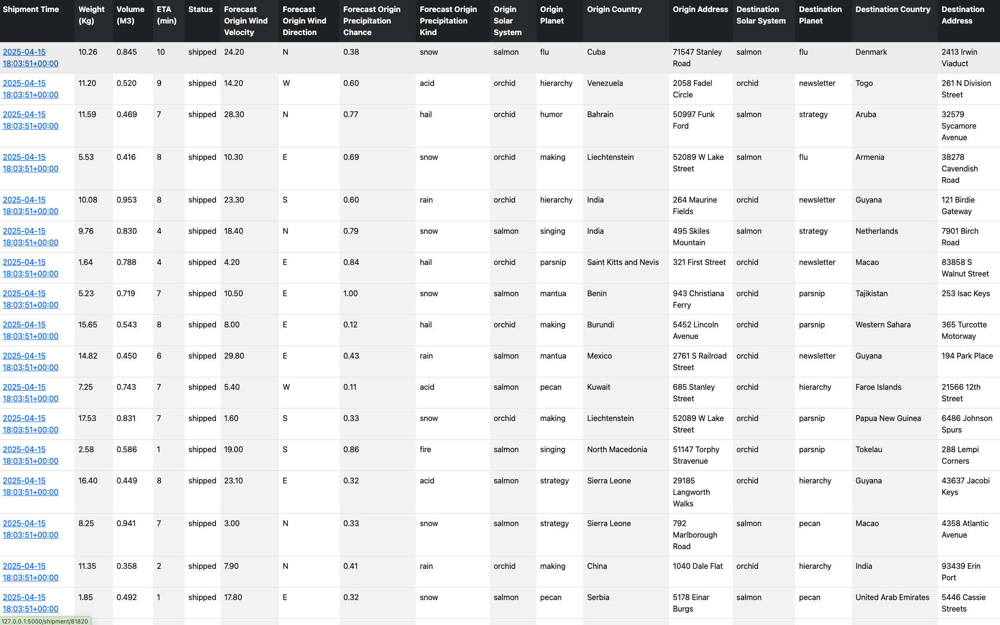
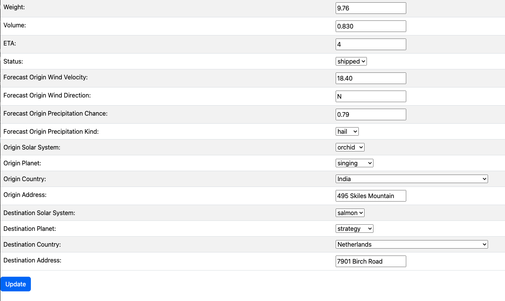

# Cosmo Cargo

## ETL Job

It runs every one minute (or whatever schedule is desired witht he support of crontab). The job reads from a file in the data directory (file name is passed in command line) and it loads it to the system. A hash for the full text of a shipment is created upon insert, to guarantee that same shipment data will not be loaded twice. So, if a job reruns a file, no harm is done. The log will show the errors and in the metrics it will show how many shipments were processed, how many were successful and how many failed.

This is how it is setup currently:

> \*/1 \* \* \* \* /Users/david/code/python/scripts/runjob.sh

the shell script does the setting of all secrets.  In a real production environment those secrets will be coming as Kubernetes secrets, AWS Secret manager, or something similar to it.  They would NOT be in a file.. specially one commited to a repo.

The output is looged to a file "etl.log".  In a production environment, this file should be piped to a logging service, like Datadog or Grafana / Loki.  Buf for dev, a log file does the trick.  Also, I would suggest changing the loggint to structured logging for easier visuallization and in order to be able to create moniitors for it.

## UI

There are 2 routes / pages for it. The default page (localhost:5000) is the list of all the shipments.

The other route (localhost:5000/shipment/{shipment\_id} is for viweing and updating one shipment.

## Database
I used Postgres 14.15 for this excercise.  I selected this version begcause that is what I was already using :).  But also, I remember hearing that it was the preferred DB for TXR backend.

SQL Scripts used to create database and entities are within the src/sql folder.