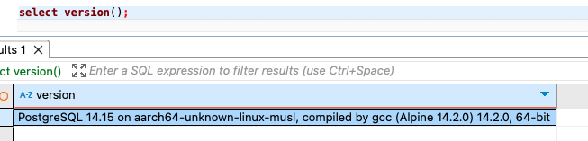

# Cosmo Cargo

## ETL Job

It runs every one minute (or whatever schedule is desired witht he support of crontab). The job reads from a file in the data directory (file name is passed in command line) and it loads it to the system. A hash for the full text of a shipment is created upon insert, to guarantee that same shipment data will not be loaded twice. So, if a job reruns a file, no harm is done. The log will show the errors and in the metrics it will show how many shipments were processed, how many were successful and how many failed.

This is how it is setup currently:

> */1 \* \* \* \* /Users/david/code/python/scripts/runjob.sh

the shell script does the setting of all secrets.  In a real production environment those secrets will be coming as Kubernetes secrets, AWS Secret manager, or something similar to it.  They would NOT be in a file.. specially one commited to a repo.

The output is looged to a file "etl.log".  In a production environment, this file should be piped to a logging service, like Datadog or Grafana / Loki.  Buf for dev, a log file does the trick.  Also, I would suggest changing the loggint to structured logging for easier visuallization and in order to be able to create moniitors for it.

## UI

There are 2 routes / pages for it. The default page (localhost:5000) is the list of all the shipments.

The other route (localhost:5000/shipment/{shipment\_id} is for viweing and updating one shipment.

## Database

I used Postgres 14.15 for this excercise. I selected this version begcause that is what I was already using :). But also, I remember hearing that it was the preferred DB for TXR backend.

SQL Scripts used to create database and entities are within the src/sql folder.

## How to run the services

1. you need to create a postgres docker container to act as our working database. For that, run the docker compose file in the /postgres directory like this:

> cd ./postgres
> docker compose up

That will create a docker image and container that host our local posgres database.

The database will be created with the environment variables (which include the default user/password) to be used when creating the docker images.  They are just samples and will need to be changed to your desired user/password.

2. Connect to the local posgress database with your favorite database client using the postgres credentials as defined in posgres/database.env.  I use dbeaver since it runs in Macos, Windows and Linux.

Once connected, execute the SQL script that create the database using the default credentials when creating the docker images (the ones in postgres/database.env)

The database creation scripts create a user for the service (cosmocargo_service), and other roles for granting users depending on the level of access they need, there is an admin, a readonly and a read/write user for them. 

Next step is to create the tables.  For that run the next script in the SQL folder (0001.table-create.sql)

3. To run the ETL service, all you need to do is switch to the scripts folder.  There is a script named runjob.sh.  This file contains all the necessary instructions (environment variables) to execute the ETL job.  This script will load all data in the data/sample_data.json file.  You can chagne the file used by modifying the script or by updating the data in the json file.

To run it on a schedule, add it to your local cron service.  I used the schedule `*/1 \* \* \* \*` to run it every minute.

There is a Dockerfile to build the image of the ETL job.  From the ETL folder, run this command to create the image

> docker build --build-arg DB_PASSWORD=cosmo_cargo -t cosmocargo-etl .

and to create the container that runs it, execute the following command

> docker run --network=host -v /path_to_your_data_folder:/app/etl_data -e DB_PASSWORD=cosmocargo --name=cosmocargo-etl -t cosmocargo-etl

4. To run the UI, just switch to the dashboard folder and run flask to start the service.  From there you can connect on localhost:5000

Since the DB and credentials are read from environment, they would need to be passed to the flast command.  One way to start flask with them is like this:

>  DB_NAME=cosmocargo DB_USER=cosmocargo_service DB_PASSWORD=cosmocargo DB_HOST=localhost DB_PORT=5432 flask run --debug

